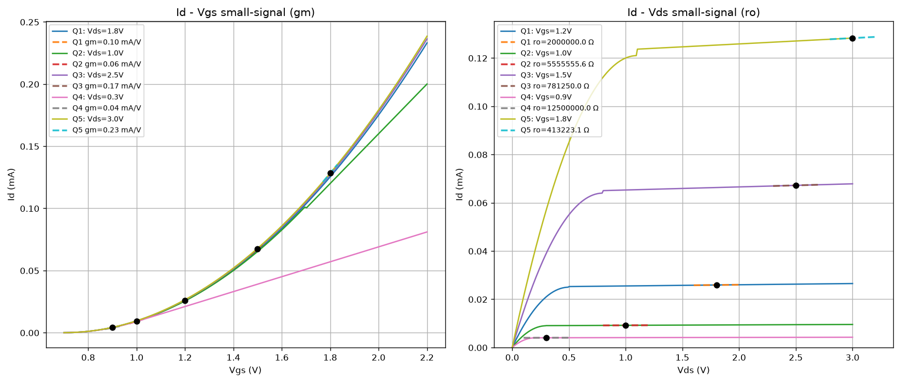
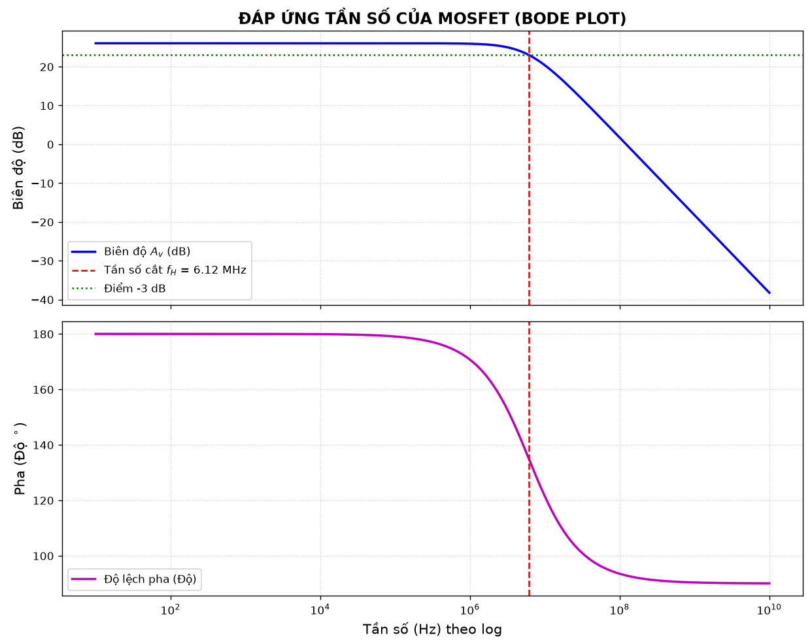
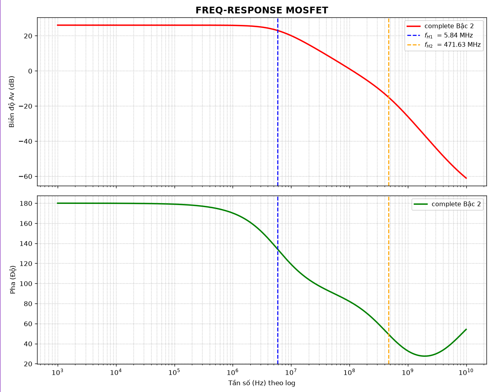

Đặc tuyến I-V với xấp xỉ small signal khảo sát giữa 2 điểm

---

BJT -- Đặc tuyến I-V_BE và V_CE với xấp xỉ small signal gm ro (I-V small signal sẽ tính theo đường tiếp tuyến đó)

MOSFET -- Đặc tuyến I-V_GS và V_DS với xấp xỉ small signal gm ro (I-V small signal sẽ tính theo đường tiếp tuyến đó). Thấy rõ 2 vùng triode và saturation ảnh hưởng bởi Vds còn Vgs thì luôn làm Id tăng

Ở những điểm giữa triode và saturation có điểm đứt gãy, nguyên nhân do mô hình có hiệu ứng channel lenght modulation -> tạo ra chênh lệch (1 + lamda) nên hàm số ko liên tục đc giữa 2 mô hình cho triode và saturation.

Đáp ứng tần số MOSFET với xấp xỉ Miller cực trội ở tần số thấp -> dùng Cgs và Cgd theo mô hình sách Razavi

Đáp ứng tần số MOSFET đầy đủ 4 cực (với cực SB nối đất do S nối đất) đầy đủ 2 cực (dominant và non-dominant) theo xấp xỉ nghiệm mẫu số hàm truyền H (theo sách Razavi)